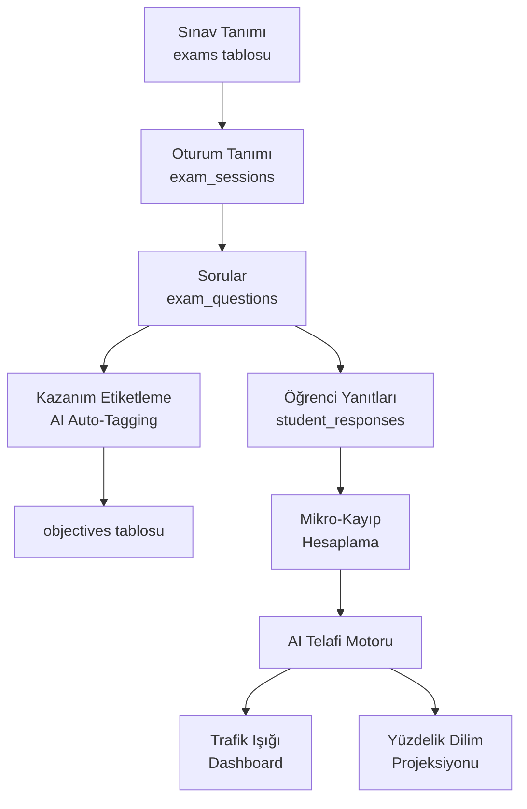

## Hedef

Mevcut `GradeRecord`/`Exam` altyapısını, LGS ve YKS'nin gerçek sınav mantığını (oturum yapısı, katsayılar, alan ayrımı) yansıtan ilişkisel bir modele dönüştürmek; üstüne AI Telafi Motoru'nun temel bileşenlerini (kazanım etiketleme, mikro-kayıp, yüzdelik dilim, trafik ışığı) inşa etmek.

---

## Mimari Genel Bakış



---

## Aşama 1: Veritabanı Şeması (Yeni Tablolar)

### 1.1 `exams` Tablosu (Sınav Paketi)

```sql
CREATE TABLE exams (
  id UUID PRIMARY KEY DEFAULT gen_random_uuid(),
  school_id TEXT NOT NULL,
  name TEXT NOT NULL,                         -- "LGS Deneme 1", "TYT Denemesi Kasım"
  exam_type TEXT NOT NULL,                    -- 'LGS' | 'TYT' | 'AYT' | 'YDT' | 'TARAMA_11'
  target_grade INTEGER,                       -- 8, 11, 12
  applied_date DATE,
  wrong_penalty_ratio DECIMAL DEFAULT 0.333,  -- LGS: 1/3, YKS: 1/4
  status TEXT DEFAULT 'PLANNED',             -- 'PLANNED' | 'DONE'
  created_at TIMESTAMPTZ DEFAULT now()
);
```

### 1.2 `exam_sessions` Tablosu (Oturum)

LGS için Sözel/Sayısal, YKS için TYT/AYT oturum ayrımını sağlar.

```sql
CREATE TABLE exam_sessions (
  id UUID PRIMARY KEY DEFAULT gen_random_uuid(),
  exam_id UUID REFERENCES exams(id) ON DELETE CASCADE,
  session_name TEXT NOT NULL,     -- 'SÖZEL' | 'SAYISAL' | 'TYT' | 'AYT' | 'YDT'
  duration_minutes INTEGER,       -- 75, 80, 165, 180
  question_count INTEGER,
  session_order INTEGER           -- Oturum sırası (1, 2)
);
```

### 1.3 `objectives` Tablosu (Kazanımlar)

```sql
CREATE TABLE objectives (
  id UUID PRIMARY KEY DEFAULT gen_random_uuid(),
  school_id TEXT NOT NULL,
  code TEXT,                      -- MEB kodu: "T.8.3.5", "AYT.MAT.türev"
  description TEXT NOT NULL,
  subject TEXT NOT NULL,          -- "Türkçe", "Matematik"
  test_context TEXT,              -- NULL=LGS | 'TYT' | 'AYT' (YKS ayrımı)
  grade INTEGER,
  unit TEXT,
  topic TEXT
);
```

### 1.4 `exam_questions` Tablosu

```sql
CREATE TABLE exam_questions (
  id UUID PRIMARY KEY DEFAULT gen_random_uuid(),
  session_id UUID REFERENCES exam_sessions(id) ON DELETE CASCADE,
  question_number INTEGER NOT NULL,
  subject TEXT NOT NULL,
  correct_answer TEXT,
  point_weight DECIMAL DEFAULT 1.0,    -- LGS katsayı farklılıkları burada
  objective_id UUID REFERENCES objectives(id),
  ai_analysis_status TEXT DEFAULT 'PENDING',  -- 'PENDING' | 'COMPLETED' | 'FAILED'
  ai_confidence_score DECIMAL,                -- AI eşleşme güven skoru (0.0-1.0)
  question_text TEXT                          -- OCR sonucu
);
```

### 1.5 `student_responses` Tablosu

```sql
CREATE TABLE student_responses (
  id UUID PRIMARY KEY DEFAULT gen_random_uuid(),
  student_id TEXT NOT NULL,
  question_id UUID REFERENCES exam_questions(id) ON DELETE CASCADE,
  given_answer TEXT,
  is_correct BOOLEAN,
  is_empty BOOLEAN DEFAULT FALSE,
  raw_score DECIMAL,
  lost_points DECIMAL,             -- Kayıp puan (mikro-kayıp hesabı)
  created_at TIMESTAMPTZ DEFAULT now()
);
```

---

## Aşama 2: TypeScript Tip Tanımları (`types.ts`)

Mevcut `Exam`, `GradeRecord` tipleri korunur, yeni tipler eklenir:

- `ExamType`: `'LGS' | 'TYT' | 'AYT' | 'YDT' | 'TARAMA_11'`
- `SessionType`: `'SÖZEL' | 'SAYISAL' | 'TYT' | 'AYT' | 'YDT'`
- `AIAnalysisStatus`: `'PENDING' | 'COMPLETED' | 'FAILED'`
- `ExamPackage`: Sınav paketi (sessions içerir)
- `ExamSession`: Oturum bilgisi
- `Objective`: Kazanım
- `ExamQuestion`: Soru + AI metadata
- `StudentResponse`: Yanıt + kayıp puan
- `PercentileData`: Yüzdelik dilim projeksiyonu için `{ year, score, percentile }[]`
- `CompensationAlert`: Trafik ışığı uyarısı `{ objectiveId, status: 'RED' | 'YELLOW' | 'GREEN', lostPoints }`

---

## Aşama 3: LGS ve YKS Puan Hesaplama Mantığı (`utils.ts`)

### 3.1 LGS Katsayıları

Sözel ve Sayısal oturumlar için ders bazlı katsayı sabitleri:

```
LGS_WEIGHTS = {
  TÜRKÇE: 4.444, MATEMATİK: 4.444, FEN: 3.333,
  T.C.İNKILAP: 1.111, DİN: 1.111, YAB.DİL: 1.111
}
```

- Her iki oturumda da 3 Yanlış = 1 Doğru iptali (sabit)
- `calculateLGSScore(responses, sessionType)` fonksiyonu

### 3.2 YKS Katsayıları

- TYT: `wrong_penalty_ratio = 0.25` (4 Yanlış = 1 Doğru)
- AYT: Aynı kural, alan bazlı filtreleme
- `calculateYKSScore(responses, examType, studentField)` fonksiyonu
  - `studentField`: `'SAY' | 'EA' | 'SÖZ' | 'DİL'`

### 3.3 Mikro-Kayıp Hesabı

```
lostPoints = (wrongCount / penalty_ratio) * point_weight * subject_coefficient
```

- Sonuç: `"Türev konusunu bilmemek sana AYT'de 4.2 puana mal oldu"`

### 3.4 Yüzdelik Dilim Projeksiyonu

- Geçmiş 5 yılın `{ year, scoreTable: { score, percentile }[] }` verisi `constants.ts`'e sabit olarak eklenir
- `getPercentileProjection(score, examType, year?)` fonksiyonu

---

## Aşama 4: AI Kazanım Etiketleme Servisi (`services/geminiService.ts`)

### Mevcut `geminiService.ts` genişletilir

`autoTagQuestion(questionText: string, objectives: Objective[]): Promise<{ objectiveId: string, confidence: number }>`

**Prompt yapısı:**
1. MEB kazanım listesi (objectives tablosundan) context olarak verilir
2. Soru metni analiz edilir
3. Gemini Flash döner: `{ objective_code, confidence_score }`
4. Eşleşme `exam_questions` tablosuna yazılır (`ai_analysis_status = 'COMPLETED'`)

**Hata yönetimi:** Gemini'den dönen hata kullanıcıya temiz uyarı mesajı olarak yansıtılır (mevcut User Rule gereği).

---

## Aşama 5: AI Telafi Motoru Mantığı

### Alan Bazlı Filtreleme (YKS İçin Kritik)

`generateCompensationAlerts(studentId, studentField, examType)`:

- SAY öğrencisine sadece TYT ortak dersler + AYT Matematik/Fen konularında uyarı
- EA öğrencisine TYT + AYT Matematik/Edebiyat
- SÖZ öğrencisine TYT + AYT Edebiyat/Tarih
- `studentField = null` olan öğrenciye (LGS) tüm dersler dahil

### Trafik Işığı Eşikleri

| Renk | Başarı Oranı | Aksiyon |
|------|-------------|---------|
| KIRMIZI | < %40 | Acil: AI otomatik ödev/video atar |
| SARI | %40–%70 | Dikkat: Pekiştirme önerisi |
| YEŞİL | > %70 | Tamamlanmış |

---

## Aşama 6: UI Bileşenleri

### 6.1 `ExamModule` (Yeni bileşen: `components/ExamModule.tsx`)

- Sınav paketi oluşturma formu: `ExamType`, oturum sayısı, tarih
- LGS seçilince → otomatik Sözel + Sayısal oturum yapısı hazırlanır
- YKS seçilince → TYT/AYT/YDT seçimi gelir
- Soru yükleme (manuel veya AI OCR)
- Optik form okuma (mevcut AI optik modülüyle entegrasyon)

### 6.2 Dashboard'a `RiskMapWidget` (mevcut `Dashboard.tsx` genişletilir)

- Trafik ışığı renk kodlu konu kartları
- KIRMIZI konular en üstte, kısaltılmış liste (max 5 konu göster)
- "Telafi görevi oluştur" butonu → ChatPanel AI'ı tetikler

### 6.3 `StudentExamDetail` (mevcut `STUDENT_EXAMS` modülüne eklenir)

- Oturum bazlı net tablosu
- Mikro-kayıp gösterimi: `"Matematik: -12.1 puan"`
- Yüzdelik dilim projeksiyonu: `"Bu puanla 2024 LGS'de %8.2'lik dilimdeydik"`
- Konu bazlı başarı barı (trafik ışığı renkleri)

---

## Doğrulama (DoD)

| Adım | Hedef Dosya | Kontrol |
|------|-------------|---------|
| DB şeması | `supabase_schema.sql` | 5 yeni tablo, FK kısıtları |
| Tipler | `types.ts` | `any` kullanımı yok, tüm alanlar typed |
| Hesaplama | `utils.ts` | LGS/YKS katsayı fonksiyonları unit test geçmeli |
| AI servis | `services/geminiService.ts` | Hata durumunda UI'a temiz mesaj |
| UI | `components/ExamModule.tsx` | Loading state, pagination (büyük veri) |
| UI | `components/Dashboard.tsx` | RiskMapWidget görünür ve tıklanabilir (min 44px) |
