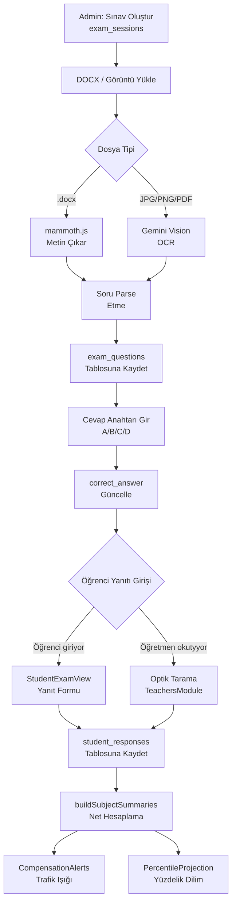

## Mevcut Durumun Tespiti

| Bileşen | Durum | Sorun |
|---------|-------|-------|
| `handleOcrUpload` | Kırık | `.docx` base64'ü Gemini'ye gönderir → yanıt gelmez → `setOcrLoading(false)` `finally` bloğunda değil → **"İşleniyor..." takılır** |
| Soru kaydetme | Eksik | `extractQuestionsFromImage` sonucu `exam_questions` tablosuna yazılmıyor |
| Cevap anahtarı | UI var | Metin yapıştırılıyor ama parse + DB yazımı yok |
| `student_responses` | Boş | Hiçbir öğrenci verisi bağlanmamış |
| Öğrenci paneli | Kısmi | `STUDENT_EXAMS` → `ExamModule` açıyor ama öğrenci kendi sınıfının sınavlarını görmüyor |

---

## Mimari Akış (Tamamlanmış Hali)



---

## Aşama 1: DOCX + OCR Pipeline Düzeltmesi

**Dosya: `components/ExamModule.tsx` → `handleOcrUpload`**

### 1.1 Dosya Tipi Ayrımı

- `.docx` / `.doc` → **mammoth.js** ile sunucu-tarafı değil, browser'da `mammoth.extractRawText()` ile metin çıkarma
  - `npm install mammoth` gerekli
- `image/*` / `.pdf` → mevcut `extractQuestionsFromImage` (Gemini Vision)
- **`setOcrLoading(false)` → `try/catch/finally` bloğuna taşı** (takılma düzeltmesi)

### 1.2 Soru Parse Etme

Gemini/mammoth çıktısından soru listesi oluşturulur:
```
[{ questionNumber: 1, questionText: "...", subject: "Matematik" }]
```

Ders tespiti:
- LGS Sözel oturumu → soru numarası aralığına göre otomatik ders ataması
  - (1-20: Türkçe, 21-25: İnkılap, 26-30: Din, 31-40: İngilizce) — yapılandırılabilir
- LGS Sayısal → (1-20: Matematik, 21-40: Fen)
- Manuel düzeltme butonu her soru için

### 1.3 `exam_questions` Tablosuna Kayıt

Her soru için Supabase insert:
```
{ session_id, question_number, subject, question_text, ai_analysis_status: 'PENDING' }
```

Sonuç: Sınav detayında `SÖZEL OTURUMU · 50 SORU` → sorular listelenir, her biri düzenlenebilir.

---

## Aşama 2: Cevap Anahtarı Bağlantısı

**Dosya: `components/ExamModule.tsx` → `handleTextSave` (genişletilecek)**

### Metin formatı desteği:
```
1-A, 2-B, 3-C, 4-D, ...
veya
1. A  2. B  3. C
veya
MAT: 1-C 2-B | FEN: 1-D 2-A
```

### İşlem:
1. Metni regex ile parse et → `{ [questionNumber]: answer }` map'i
2. Supabase'de `exam_questions` tablosunda `correct_answer` sütununu **toplu güncelle** (bulk update)
3. UI'da her sorunun yanında yeşil tik göster

---

## Aşama 3: Öğrenci Paneli Entegrasyonu

### 3.1 Sınıf-Sınav Bağlantısı

**Yeni sütun: `exams` tablosuna `class_ids TEXT[]`** (hangi sınıflar bu sınavı gördü)
- Sınav oluşturulurken veya sonrasında sınıf ataması yapılır
- Öğrenci → kendi `classId`'si → ilgili sınavları filtreler

### 3.2 `StudentExamView` (Yeni bileşen)

**Görünüm akışı:**
```
Öğrenci giriş → SINAVLAR sekmesi
  → "DENME1 · LGS · 2026-02-28" kartı
  → [YANIT GİR] butonu
  → Her oturum için yanıt formu (A/B/C/D butonları, 50 soru)
  → [TAMAMLA ve GÖNDER] → student_responses tablosuna toplu insert
  → Anında analiz ekranı (net tablosu + trafik ışığı)
```

### 3.3 `student_responses` Kayıt Mantığı

Her soru için:
```typescript
{
  student_id: session.id,
  question_id: q.id,
  given_answer: "B",
  is_correct: q.correctAnswer === "B",
  is_empty: false,
  raw_score: is_correct ? q.pointWeight : 0,
  lost_points: !is_correct && !is_empty
    ? q.pointWeight * penaltyRatio * subjectCoefficient
    : 0
}
```

---

## Aşama 4: Konu/Soru Bazlı Analiz (Ne Zaman?)

Analiz **student_responses kaydedildiği anda** tetiklenir (gerçek zamanlı):

### Admin/Öğretmen Paneli (mevcut Dashboard RiskMapWidget):
- Sınıf ortalaması → her ders için ortalama başarı oranı
- En çok yanlış yapılan sorular (soru numarası bazlı)
- Konu bazlı analiz için `objective_id` bağlantısı varsa → kazanım haritası

### Öğrenci Paneli (StudentExamView sonuç ekranı):
1. **Net Tablosu** → Ders | D | Y | B | Net | Kayıp Puan
2. **Trafik Işığı** → Kırmızı/Sarı/Yeşil ders kartları
3. **Yüzdelik Dilim** → "2025 LGS'de bu puanla %X dilimdeydik"
4. **Mikro-Kayıp** → "Fen Bilimleri'ni tam yapsaydın +4.2 puan"
5. **AI Öneri** → ChatPanel tetiklenir: "Türkçe'de söz sanatları konusuna bak"

### Kazanım Bazlı Analiz (opsiyonel, sonraki adım):
- `exam_questions.objective_id` doldurulduktan sonra etkinleşir
- AI auto-tagging: `autoTagQuestion()` fonksiyonu zaten mevcut
- Öğrencinin yanlış yaptığı soruların kazanım kümesi → hedef kazanım listesi

---

## Aşama 5: Veri Akışı Özeti

```
exams (1)
  └── exam_sessions (2: SÖZEL + SAYISAL)
        └── exam_questions (90 soru: correct_answer dolu)
              └── student_responses (her öğrenci × her soru)
                    └── buildSubjectSummaries()
                          ├── net, lostPoints, successRate
                          ├── CompensationAlerts (trafik ışığı)
                          └── getPercentileProjection()
```

---

## Doğrulama (DoD)

| Adım | Hedef | Kontrol |
|------|-------|---------|
| DOCX parse | `mammoth.js` entegre | `setOcrLoading(false)` finally'de, hata UI'a yansıyor |
| Soru kayıt | `exam_questions` dolu | Sınav detayında soru listesi görünüyor |
| Cevap anahtarı | `correct_answer` dolu | Her soruda yeşil tik |
| Öğrenci yanıtı | `student_responses` dolu | Gönder sonrası analiz anında açılıyor |
| Sınıf filtresi | `class_ids` bağlantısı | Öğrenci sadece kendi sınıfının sınavlarını görüyor |
| Analiz | Net/kayıp/dilim doğru | LGS katsayıları (4.444/3.333/1.111) uygulanıyor |

---

## Uygulama Sırası (Bağımlılık Sırasıyla)

1. `mammoth` kurulumu + `handleOcrUpload` finally bloğu düzeltmesi → **DOCX işleme çalışır**
2. Parse + `exam_questions` DB kaydı → **sorular görünür**
3. Cevap anahtarı parse + bulk update → **correct_answer dolar**
4. `exams` tablosuna `class_ids` ekleme + öğrenci filtresi
5. `StudentExamView` bileşeni → yanıt formu + gönderim
6. Analiz ekranı öğrenci panelinde açılır
